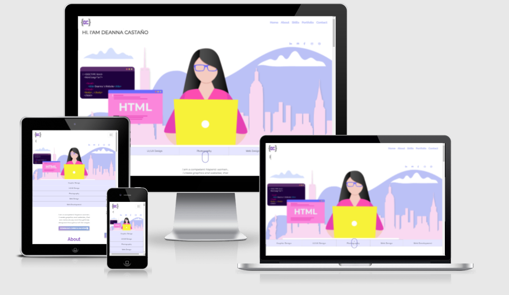
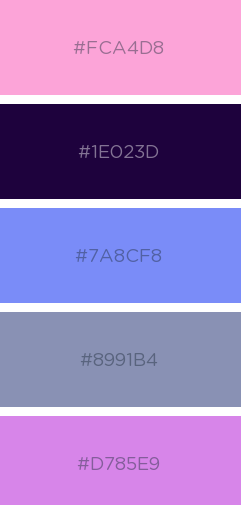
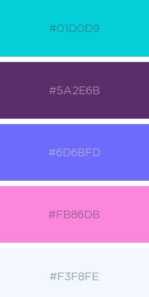

# **Deanna Castano’s Portfolio Website**<h1>
### [View the live website here.]( https://dcdesigner.github.io/DCastano-Portfolio/)<h3>

This is the mockup image of Deanna Castano’s portfolio website. 

It is designed to be responsive and accessible on a range of devices and compatible with several browsers. The design has a minimalist approach and easy to navigate for future employers, top companies, small business clients anyone that is looking to hiring a UI/UX Designer, Graphic Designer or a Front-End Developer. She is also currently doing a bootcamp as a Full Stack Software Developer. 

# **User Experience** (UX)<h1>

## **User stories**<h2>

**First Time Visitor Goals**

### a.	As a first time visitor, I want to easily visualize the persons skills and professional/educational background.<h3>

### b.	As a first time visitor, I want to be able to easily navigate throughout the site to find sample work, resume and social media.<h3>

**Returning Visitor Goals**

a.	As a Returning Visitor, users can relook at resume, social media accounts or use the contact form to get in touch with me if interested in my services for a project.<h3>

**Frequent User Goals**

a.	As a Frequent User, I want to see new project samples.

b.	As a Frequent User, I want to see if new features have been added.

## **Design**<h2>

**Color Scheme**

a.	The main colors are different tones of purple, pink, blues and touches of yellow which is the opposite color of purple. I picked these colors because I wanted different shades to represent some words, I had in mind that I wanted to represented visually. Words like feminine, balance, creative, and energy. The colors all looked good when combined.

b.	The nav and social media use a light purple, so once hovered on a brighter color appears. Purple for nav and yellow for social media. The purpose of this was to distinguish and let users know what they are clicking on.

c.	Color is used all around the site in headers buttons and main image.

**Typography**

 a.	My h1 font is Raleway used for big headings. It is a San Serif font to give the website a modern look. The fallback font if Raleway does not work is Roboto, San Serif. My h2 is Montserrat also San Serif used for my p tag text and is used for small text. The fallback for Montserrat is Nunito Sans, San Serif Both fonts are free from Google Fonts.<h3>

b.	I wanted big headings for the visitors to clearly know what section they were in.

c.	The typewriter effect on the top left was used to represent visually what developers do a lot which is type. Therefore, I used it to welcome visitors and describe a few things that I can do.<h3>

**Imagery**

### a.	The large main image at the top represents the creator of the site at work on her desk with a background of where she grew up. With details showing what she is working on the side.<h3>

b.	The icons from the skills are a visual representation of the categories.

c.	The purpose of the yellow laptop was so that the scroll animation icon could be more visible. At first it was grey like a usual mac, but the scroll icon was not that visible. I decided to play with opposite colors.

d.	I wanted the gallery to be interactive for the visitors to choose what they wanted to see first. Therefore, the gallery has options to see all projects in one space or only see a certain category at a time. This is great if a future employer is looking for something specific. 

e.	For the skills I wanted one main image to represent each category list. This would make it easy to read and have one visual representation to balance the list of text.<h3>

**Wireframes**

### My wireframe is a single page website with 5 sections. 
Home – About – Skills - Portfolio – Contact

My initial wireframe has a different style for the skills section. My final decision was to make it more straight forward and tighten up space using words rather than using imagery of apps and percentage icons which, would make not make a visual clean section with a lot of colors and sizes of images representing each word and a very long page.
Preview wireframes here<h3>

### [View Wireframes here.](https://github.com/DCDesigner/DCastano-Portfolio/blob/master/assets/images/readme_files/wireframes.pdf)<h3>

## **Features**<h2>

Responsive on all device sizes
Interactive elements
Social media buttons
Button to download resume
Gallery to show work
Contact form 
A button to scroll to the top of the page at the button of the site

# Technologies Used<h1>

## **Languages Used**<h2>

1. HTML5
2. CSS3
3. JS

## **Frameworks, Libraries & Programs Used**<h2>
1.	**Bootstrap 4.4.1:** Bootstrap was used to create a responsive website.
2.	**Google Fonts:**
Google fonts were used to import the 'Raleway & Montserrat' font into the style.css as the main fonts. Roboto and Nunito Sans are the fallback fonts just in case the main fonts did not load.
3.	**Font Awesome:**
Font Awesome was used on the skills section to add icons to add a visual representation of the headings.
4.	**jQuery:**
jQuery came with Bootstrap to make the navbar responsive. 
I used the scroll down symbol on top of the yellow computer image to let visitors know to scroll down the page, there is more to see. This was created my Hasan.
Back to top button uses JavaScript so that its faster to go up to the top again. I noticed the link no longer works to give credit to Hasan. 
The portfolio gallery uses JavaScript for an easy transition when finding sample work organized into different categories. Link to Agustin Guanipa gallery snippet.
The typewriter at the top of my page was created by Daniel Groen. 
*Note- I customized all these snippets to fit my visual needs of how I wanted my website to look like.

5.	**Git:** Git was used for version control by utilizing the Gitpod terminal to commit to Git and Push to GitHub. Gitpod was where I did all my editing of the website and previews.
6.	**GitHub:** GitHub is used to store the projects code after being pushed from Git.
7.	**Illustrator:**
Illustrator was used to create the logo and main image and the top of the website.
Illustrator was used to optimize images for web.

8.	**Balsamiq:**
Balsamiq was used to create the wireframes during the design process.

# Testing<h1>
The **W3C Markup Validator** and **W3C CSS Validator Services** were used to validate every page of the project to ensure there were no syntax errors in the project. Html formatter was used to beautify the code with correct indentations, to make it readable and easy to find the section of code. Lighthouse is a tool is Dev tools used to test the speed of the website. Page speed insight from Google helped me understand the performance of my website on a desktop and mobile. Both had different speeds. The mobile had a speed of 73 and desktop 47 * images below. 

1.	W3C Markup Validator  
2.	W3C CSS Validator
3.	Html Formatter
4.	Lighthouse
5.	Page speed insight 
 
 * [View Markup Validator here.](https://github.com/DCDesigner/DCastano-Portfolio/blob/master/assets/images/readme_files/W3CValidator.png) 
 * [View CSS Validator here.](https://github.com/DCDesigner/DCastano-Portfolio/blob/master/assets/images/readme_files/W3CCSSValidator.png)
 * [View Lighthouse test here.](https://github.com/DCDesigner/DCastano-Portfolio/blob/master/assets/images/readme_files/lighthouse_test.png)
 * [View Page Speed Insights Mobile here.](https://github.com/DCDesigner/DCastano-Portfolio/blob/master/assets/images/readme_files/PageSpeed_Insights_mobile.png)
 * [View Page Speed Insights Desktop here.](https://github.com/DCDesigner/DCastano-Portfolio/blob/master/assets/images/readme_files/PageSpeed_Insights_desktop.png)

# Testing User Stories from User Experience (UX) Section<h1>

## First Time Visitor Goals<h2>
1.	As a First Time Visitor, I want to easily understand the main purpose of the site and learn about the professional experience of the person. 

2.	Upon entering the site, users are automatically greeted with a clean and easily readable navigation bar to go to the page of their choice. They have a feel for who the person is and what she does. 

3.	The main points are made immediately with the image of a woman on a laptop coding. 

4.	Each section gives more detail in text and sample work of the skills that they have.

5.	As a First Time Visitor, I want to be able to easily be able to navigate throughout the site to find content.

6.	The site has been designed to be straightforward for users not to get lost. Everything is on a single page website.  At the top of each page there is a clean navigation bar, each link describes what the page is about.

7.	The social media icons are immediately at the top of the page to not have to scroll and look for them. They are also towards to middle of the page in the about section. 

8.	The user has two options, scroll down the page, or choose a page of their choice. It depends on what their needs are. 

9.	Once the visitor scrolls down, there is a personal message that has a call to action button. Once clicked on the resume, it opens on a new page and there is an option to print or download.
	
10.	At the bottom of the page there is a button called top to easily go back to the beginning at not have to scroll all the way back. 

11.	On the Contact Us Page, after a form response is submitted, the page refreshes and the user is brought to the top of the page where the navigation bar is.

## Returning Visitor Goals<h2>

1. As a returning user, I want to quickly have access to social media accounts.

2. The resume should be easy to find. The resume is towards the top of the page for easy access and in the about me section.

3. I want to have up-to-date information and more projects added. 

## **Further Testing**<h2>

1.	The Website was tested on Google Chrome, Microsoft Edge, Firefox and Safari browsers.

2.	The website was also tested on www.parrotqa.com. I did see on difference so decided to download the actual browsers. I noticed that testing websites are not completely accurate.

3.	The website was viewed on a variety of devices such as Laptop, iPhone7plus and iPad.

* [View Safari test here.](https://github.com/DCDesigner/DCastano-Portfolio/blob/master/assets/images/readme_files/ParrotQA_safari_test.png)

* [View Firefox test here.](https://github.com/DCDesigner/DCastano-Portfolio/blob/master/assets/images/readme_files/ParrotQA_firefox_test.png)

* [View Chrome test here.](https://github.com/DCDesigner/DCastano-Portfolio/blob/master/assets/images/readme_files/ParrotQA_chrome_test.png)

**Known Bugs**

1. There are known bugs on both the html and css due to the snippets I used from Agustin Guanipa gallery snippet. The image src are being added dynamically from line 53 of my gallery.js file.
2.	There are 1196 errors and 1302 warnings that I am aware about in the CSS validator. Some come from https://stackpath.bootstrapcdn.com/bootstrap/4.4.1/css/bootstrap.min.css
3.	The other errors or warnings are from the snippets that I used from other coders that I credited.
4.	The images in my portfolio section sometimes load slow on desktop. I checked on other devices and it fine. I did size them down to less than 2,500px. I researched in several websites they all say different sizes. Link to size reference I also tested the speed of my website with Page speed insight from Google. I can see the images halfway loaded if I scroll immediately superfast to the portfolio section. But since I know visitors will take a bit of time to get to that section its fine. Its only the photography section images that take a bit more to load.
5.	For media query screen size galaxy fold 280px, the word portfolio is sticking out a bit causing the website to have a horizontal scroll. This is a known issue because I want the font size og h1 to big as big as possible on all devices. I can into an issue because the only screen size that was not looking good was the galaxy. So the h1 tag I wanted to put a media query with a smaller font size but, it did not work. The h1 tag as the !important so that the main font loads and not the fallback fonts. This causes issues when wanting to put !important on the new font size for the media query, because it will override. As the tutor mentioned I have to several !important which its suggested not to use, because this like this will happen. So I had to choose a font size that would be at least visible to all screen sizes even though the galaxy fold has a horizontal scroll. I am aware and ok with that.
6.	I am aware of the problems displayed in Gitpod regarding property python and launch.json.
[View Gitpod Errors here.](https://github.com/DCDesigner/DCastano-Portfolio/blob/master/assets/images/readme_files/gitpod_errors.png)

# Deployment<h1>
## GitHub Pages<h2>
The project was deployed to GitHub Pages using the following steps...
1.	Log in to GitHub and locate the GitHub Repository
2.	At the top of the Repository (not top of page), locate the "Settings" Button on the menu.
o	Alternatively Click Here for a GIF demonstrating the process starting from Step 2.
3.	Scroll down the Settings page until you locate the "GitHub Pages" Section.
4.	Under "Source", click the dropdown called "None" and select "Master Branch".
5.	The page will automatically refresh.
6.	Scroll back down through the page to locate the now published site link in the "GitHub Pages" section.
Forking the GitHub Repository
By forking the GitHub Repository we make a copy of the original repository on our GitHub account to view and/or make changes without affecting the original repository by using the following steps...
1.	Log in to GitHub and locate the GitHub Repository
2.	At the top of the Repository (not top of page) just above the "Settings" Button on the menu, locate the "Fork" Button.
3.	You should now have a copy of the original repository in your GitHub account.
Making a Local Clone
1.	Log in to GitHub and locate the GitHub Repository
2.	Under the repository name, click "Clone or download".
3.	To clone the repository using HTTPS, under "Clone with HTTPS", copy the link.
4.	Open Git Bash
5.	Change the current working directory to the location where you want the cloned directory to be made.
6.	Type git clone, and then paste the URL you copied in Step 3.
$ git clone https://github.com/YOUR-USERNAME/YOUR-REPOSITORY
7.	Press Enter. Your local clone will be created.
$ git clone https://github.com/YOUR-USERNAME/YOUR-REPOSITORY
> Cloning into `CI-Clone`...
> remote: Counting objects: 10, done.
> remote: Compressing objects: 100% (8/8), done.
> remove: Total 10 (delta 1), reused 10 (delta 1)
> Unpacking objects: 100% (10/10), done.
Click Here to retrieve pictures for some of the buttons and more detailed explanations of the above process.

# Credits<h1>
## Code<h2>
*	The scroll symbol was created my Hasan.
*	Back to top button uses JavaScript so that its faster to go up to the top again. I noticed the link no longer works to give credit to Hasan.
*	The portfolio gallery uses JavaScript for an easy transition when finding sample work organized into different categories. Link to Agustin Guanipa gallery snippet.
*	The typewriter at the top of my page was created by Daniel Groen. 
*	Bootstrap4: Bootstrap Library used throughout the project mainly to make site responsive using the Bootstrap Grid System.
*	The gradient web kit unknown source website not found

## Content<h2>
*	All content was written by the developer.
*	To find inspiration on colors I used Coolors.
*	The meaning of colors and why help me decide.

## Media<h2>
*	All Images were created by the developer and used fontawesome for icons.
Acknowledgements
*	My Mentor for continuous helpful feedback and the tutors helped me along the way guiding me on how to do something or fix an issue.

**Final Thoughts**

In the future I will create my own gallery and learn to code the things that I used on my website from other developers from scratch.

